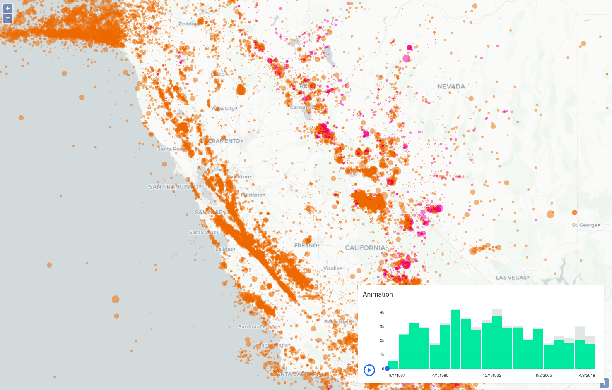

[Live example here!](https://jahow.github.io/ol-airship-bridge/)

Airship components are UI widgets made for data visualization and available as web components:
* [Documentation](https://carto.com/developers/airship/)
* [API reference](https://carto.com/developers/airship/reference/)
* [An example of a time series widget bound to a Carto-VL layer](https://github.com/CartoDB/airship/blob/40c92ba3b18c69e4ae9b64a6234bd0cc1542b969/packages/components/src/components/as-time-series-widget/cordoba.html)

This example uses [OpenLayers 6.1.1](https://www.github.com/openlayers/openlayers) and its experimental [`WebGLPointsLayer`](https://github.com/openlayers/openlayers/blob/master/src/ol/layer/WebGLPoints.js) to render the map.

A CSV dataset describing around 50,000 earthquakes is loaded at startup. All features are then added to the map with
a style that show points with sizes dependent on the magnitude.

At the same time, all the features are also sent to a dedicated worker (using GeoJSON as an exchange format, as OL features are not
serializable). The worker is then in charge of finding the features in the current view extent using
`vectorSource.getFeaturesInExtent` and computing the data intended for the time series widget (buckets with start/end dates and
an amount of features in each).

The worker then sends back only the buckets to the main thread, which injects the data in the time series widget.

To run the example, `npm install && npm run start` then navigate to http://localhost:8080.
